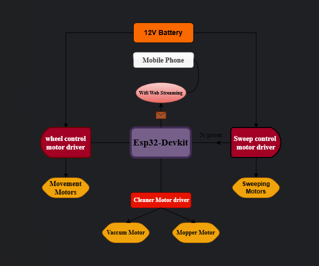

# 🛰 AUTONOMOUS MULTI-STAGE CLEANING ROVER

  

An **ESP32-based autonomous floor-cleaning rover** designed and built by an **S4 Electronics and Communication Engineering (ECE) student team**.  
The rover combines **differential-drive locomotion**, **multi-stage debris handling**, and **web-based autonomous control**, with real-time obstacle avoidance.

---

## 📸 DEMONSTRATION

  

---

# 📌 PROJECT CONTEXT

- **Academic Level:** Semester 4 – ECE  
- **Project Type:** Team-based embedded robotics project  
- **Focus Areas:**
  - Embedded systems
  - Robotics & mechatronics
  - Motor control and power electronics
  - Sensor-based autonomy
  - Hardware–software co-design

The goal was to design and implement a **real-world autonomous cleaning robot**, focusing on **system integration**, **reliability**, and **practical engineering constraints**.

---

# 📐 SYSTEM OVERVIEW

  

The rover is divided into **four major subsystems**:

1. **Locomotion & Steering**  
2. **Multi-Stage Cleaning Mechanism**  
3. **Sensing & Autonomous Behavior**  
4. **Wireless Control & Supervision**  

The system is powered by a **12 V onboard battery**, supplying sufficient torque and airflow for cleaning while keeping control electronics stable.

---

# ⚙️ MECHANICAL ARCHITECTURE

  

## 🔁 MULTI-STAGE CLEANING PIPELINE

| Stage | Mechanism | Purpose |
|-----|----------|--------|
| Front | Dual sweep motors | Funnel debris toward centerline |
| Center | Vacuum motor | Extract collected debris |
| Rear | Mop motor | Final surface cleaning and finishing |

This **staged design** ensures debris is collected and the surface is polished in a single forward pass.

---

# 🔁 LOCOMOTION SYSTEM

- **Differential drive** using two primary DC motors  
- Independent PWM speed control for left and right wheels  
- Turning via controlled speed differential  
- Locomotion mechanically isolated from cleaning loads for stable navigation  

---

# ⚡ POWER SYSTEM ARCHITECTURE

- **Primary power source:** 12 V onboard battery  
- **High-current loads:** drive motors, front sweep motors, vacuum motor, mop motor  
- **Low-voltage electronics:** ESP32 and sensors powered through regulated supply  
- Shared ground with noise-aware power distribution

This architecture ensures reliable operation under varying mechanical loads while maintaining control stability.

---

# 🔌 ELECTRICAL & CONTROL SYSTEM

  

## CORE COMPONENTS

- ESP32 microcontroller (Wi-Fi Access Point mode)  
- 12 V battery power system  
- Multiple motor drivers for independent actuation  
- Triple ultrasonic distance sensors (Left, Center, Right)  
- PWM-based motor speed control  
- Battery-powered standalone operation  

---

# 🧠 CONTROL & FIRMWARE ARCHITECTURE

The firmware is structured around:

- Task state management  
- Motor control logic  
- Sensor feedback processing  
- HTTP server routing  

The rover can run **autonomous circular and lawn-mower cleaning patterns**, while continuously monitoring obstacles.

---

# 🤖 AUTONOMOUS BEHAVIOR

## 🧠 OBSTACLE DETECTION & RESPONSE

The rover continuously monitors its surroundings:

- **Left obstacle:** steer right  
- **Right obstacle:** steer left  
- **Center obstacle:** immediate stop  

Obstacle checks run even during autonomous cleaning patterns.

---

## 🌀 CLEANING MOTION PATTERNS

- **Circular pattern:** radius-based differential speed control  
- **Lawn-mower pattern:** systematic back-and-forth area coverage  

All motion patterns are **interruptible and reactive** to sensor input.

---

# 🌐 WEB-BASED CONTROL INTERFACE

  

- ESP32 operates as a **standalone Wi-Fi access point**  
- Browser-based control dashboard  
- Start/stop autonomous cleaning tasks  
- Emergency stop functionality  

No external router or mobile application required.

---

# 📂 SOFTWARE STRUCTURE

The firmware is modular:

- Task management  
- Motor control and speed regulation  
- Sensor processing and obstacle detection  
- HTTP server for web-based control  

---

## 🧪 TESTING & VALIDATION

- Verified obstacle detection for all three sensor directions  
- Continuous operation testing of all cleaning motors  
- Autonomous pattern execution on real surfaces  
- Stable ESP32 operation under 12 V motor load conditions  
- Web interface tested on mobile and desktop browsers  

---

## 🔮 FUTURE IMPROVEMENTS

- Battery telemetry and low-voltage protection  
- Encoder-based closed-loop motion control  
- Coverage optimization algorithms  
- SLAM-based navigation and mapping  

---

## 👥 TEAM

This project was **designed, built, and tested collaboratively** by an **S4 ECE student team**, covering:

- Sreeram Raman  
- Alan Babu 
- Abin Stainslaus  
- Abraham Joseph
- Abhichandra TV
- Alfred Anto

---

## 📜 LICENSE

Educational open-source project.

